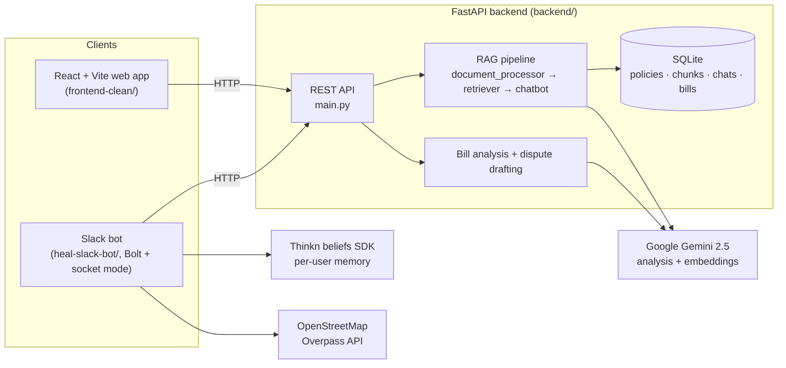

# HEAL.AI — Your healthcare financial advocate

<div align="center">

**🏆 2nd Place — Devlabs Hackathon**

*Upload your insurance policy and a medical bill. HEAL reads both, flags overcharges and billing errors, explains your coverage in plain English, and drafts a formal dispute letter — in a web app **or** right inside Slack.*

[](https://fastapi.tiangolo.com/)
[](https://reactjs.org/)
[](https://www.typescriptlang.org/)
[](https://ai.google.dev/)
[](https://www.python.org/)
[](https://slack.dev/bolt-js/)

**🔗 Live demo:** _add your Railway URL here after deploy_ &nbsp;·&nbsp; **🎬 Slack walkthrough:** _add a Loom/GIF here_

</div>

> **Try it in 2 minutes:** upload [`backend/sample_data/sample_policy.pdf`](backend/sample_data/), then run the bill checker on [`sample_bill_overcharged.pdf`](backend/sample_data/) — watch it catch a duplicate charge, a wrongly-billed preventive service, and an inflated ER copay, then draft the dispute.

---

## The problem

Roughly **1 in 3 US medical bills contains an error**, and most patients can't read an EOB, can't tell when they've been overcharged, and have no idea how to dispute. HEAL closes that gap using the tools people already have open at work or school.

- **Upload your policy** → AI extracts deductible, out-of-pocket max, copays, coinsurance.
- **Upload a bill** → AI cross-references it against your coverage, flags errors and overcharges, and drafts a dispute letter.
- **Ask anything** → plain-English, source-cited answers about what's covered.

## What makes it different

- **No new tab needed.** The whole flow runs as a **Slack DM** — employees/students use it without leaving their workflow. A polished React web app is the second front end.
- **Grounded answers, with citations.** The RAG chat answers only from your uploaded documents and cites the source chunk, so you can trust the number.
- **Real-world data, not guesses.** Nearby hospitals come from OpenStreetMap (Overpass API), not model speculation.
- **Persistent memory.** Per-user knowledge graph (Thinkn `beliefs` SDK) remembers your policy and history across restarts.
- **One-click dispute + calendar.** Send a formal dispute letter to billing from Slack; book a campus health appointment and get a pre-filled `.ics`.

---

## Architecture



### Stack
- **Backend** — FastAPI (Python 3.11), SQLite, a from-scratch RAG pipeline (`backend/rag/`).
- **AI** — Google Gemini 2.5 (`gemini-2.5-flash`/`pro`) for analysis; `gemini-embedding-2-preview` (768-dim) for embeddings.
- **Web** — React 18 + TypeScript + Vite + Tailwind + shadcn/ui (`frontend-clean/`).
- **Slack** — `@slack/bolt` v4 (socket mode), Thinkn `beliefs` SDK for memory (`heal-slack-bot/`).

---

## Getting started

Two tracks. The **web app** is the fast path (~10 min). The **Slack bot** is optional and takes longer because Slack app setup is manual.

### Prerequisites
- Python 3.11+, Node 18+
- A Google Gemini API key — https://aistudio.google.com
- (Slack track only) a Slack workspace where you can install an app

### 1. Clone
```bash
git clone https://github.com/pranawwwww/HEAL_AI.git
cd HEAL_AI
```

### 2. Backend (FastAPI)
```bash
cd backend
python -m venv venv
# Windows: venv\Scripts\activate   |   macOS/Linux: source venv/bin/activate
venv/Scripts/activate
pip install -r requirements.txt
cp .env.example .env          # then edit .env and set GEMINI_API_KEY
python main.py                # http://localhost:8000  (docs at /docs)
```
> The backend **refuses to start without `GEMINI_API_KEY`** so it never silently serves fake data. To run the frontend against fake data anyway, set `ALLOW_MOCK=1` in `.env`.

### 3. Web frontend (React)
```bash
cd frontend-clean
cp .env.example .env          # optional: set VITE_API_BASE_URL to a deployed backend
npm install
npm run dev                   # http://localhost:8080
```
Now upload `backend/sample_data/sample_policy.pdf`, then check `sample_bill_overcharged.pdf` against it.

### 4. Slack bot (optional / advanced)
Socket-mode bot; needs a Slack app with the scopes listed in [`heal-slack-bot/README.md`](heal-slack-bot/README.md).
```bash
cd heal-slack-bot
cp .env.example .env          # SLACK_BOT_TOKEN, SLACK_APP_TOKEN, HEAL_BACKEND_URL, BELIEFS_KEY
npm install
node app.js
```
> A Slack bot isn't a clickable link, so for reviewers the Slack experience is captured as a Loom/GIF (linked at the top). The web app is the live demo.

---

## How it works

**Policy analysis** — extract text (PDF/OCR) → Gemini structured extraction → confidence-scored JSON → stored.

**RAG chat** — chunk documents → embed (768-dim) → retrieve relevant chunks → **grounded generation** (answer only from context) → **inline citations** to the source chunk. If the context doesn't contain the answer, it says so instead of guessing.

**Bill analysis** — Gemini reads the bill against your policy → financial breakdown → flags duplicates, non-covered charges, and copay/coinsurance mismatches → drafts an FDCPA-style dispute letter.

---

## What I built

HEAL.AI was built by a small team at the Devlabs Hackathon (see [CONTRIBUTORS.md](CONTRIBUTORS.md)). My primary contributions on this branch:

- **The entire Slack bot** (`heal-slack-bot/`) — conversational flow, file uploads, bill checking, one-click dispute send, and calendar `.ics` generation, all in socket mode.
- **Per-user persistent memory** via the Thinkn `beliefs` SDK (isolated belief graph per Slack user, survives restarts).
- **Real hospital lookup** via OpenStreetMap/Overpass instead of model-hallucinated locations.
- **RAG groundedness + inline citations** and reliability fixes in the retrieval pipeline (`backend/rag/`).
- **QA + hardening** — state-machine bug fixes, PII hygiene, mock-mode guardrails, sample data, and this deployment path.

## Roadmap (next up)

Deferred but scoped — see [`docs/UPGRADE_PLAN.md`](docs/UPGRADE_PLAN.md) for the full reviewed plan.

- Hybrid retrieval (BM25 + dense with reciprocal-rank fusion) for exact code/policy-number matches
- Cross-encoder reranking
- An eval harness (RAGAS/DeepEval) with a golden set + a deterministic numeric exact-match metric, gated in CI
- LLM observability/tracing
- PHI-minimizing redaction at embedding time
- Postgres + pgvector for durable, indexed vector storage

---

## Credits

Built for the **Devlabs Hackathon** (2nd place). Uses Google Gemini, the Thinkn `beliefs` SDK, and OpenStreetMap. Team credits in [CONTRIBUTORS.md](CONTRIBUTORS.md).
